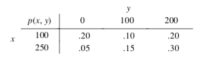
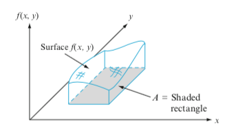

# Distribuições de probabilidade conjunta

## Vetores aleatórios

Vimos até agora distribuições de probabilidade referentes a uma única variável aleatória.

Entretanto, é comum termos interesse em analisar probabilidades de duas ou mais variáveis aleatórias simultaneamente.

Ex: lançar uma moeda 3 vezes. Seja $X_i$ a v.a. indicando o resultado do $i$-ésimo lançamento ($X_i=1$, se cara e $X_i=0$, se coroa). Então o resultado do experimento é representado pelo **vetor aleatório**:
$$\mathbf{X}=(X_1,X_2,X_3)$$

## Duas variáveis aleatórias discretas

Sejam $X$ e $Y$ duas v.a. discretas definidas no espaço amostral $\Omega$ de um experimento e $\mathbf{X}=(X,Y)$ o vetor aleatório. A **função de probabilidade conjunta** $p(\mathbf{x})$ é definida para cada par de números $\mathbf{x}=(x,y)$ por:

$$p(\mathbf{x})=p(x,y)=P(X=x, Y=y)$$
Temos que $p(\mathbf{x})\geq0$ e $\sum_x\sum_yp(x,y)=1$.

Agora, seja $A$ qualquer conjunto particular que consista em pares de valores $\mathbf{x}$. Então:
$$P[\mathbf{X}\in A]=\sum_{\mathbf{x}\in A}p(\mathbf{x})$$

Ex: $A=\{(x,y): x+y=5\}$ ou $A=\{(x,y): \max(x,y)\leq 3\}$.

## Exemplo

Ao adquirir um seguro residencial ou para carro, a pessoa deve escolher o valor da franquia. Uma empresa oferece os seguintes valores de franquia para carro: $\$100$, $\$250$. Para residência: $\$0$, $\$100$, $\$200$. Considere selecionar ao acaso um cliente com essas duas apólices na empresa. 

$X$: franquia do carro $Y$: franquia da residência. Temos a seguinte tabela de probabilidade conjunta:

$P(X=100,Y=0)=0.2$, $P(X=250,Y=200)=0.30$.

## Exemplo

$X$: franquia do carro $Y$: franquia da residência. Temos a seguinte tabela de probabilidade conjunta:

$P(Y\geq 100) = P(X=100,Y=100)$
$+P(X=250,Y=100)+P(X=100,Y=200)$
$+ P(X=250,Y=200)=0.75$

$P(X=100) = P(X=100,Y=0)+P(X=100,Y=100)$
$+P(X=100,Y=200)=0.50$

## Distribuição Marginal

A **função massa de probabilidade marginal de $X$**, denotada por $p_X(x)$ é dada por:

$$p_X(x)=\sum_{y:p(x,y)>0}p(x,y)$$
A **função massa de probabilidade marginal de $Y$**, denotada por $p_Y(y)$ é dada por:

$$p_Y(y)=\sum_{x:p(x,y)>0}p(x,y)$$

## Duas variáveis contínuas

A probabilidade de que o valor observado de uma v.a. contínua $X$ fique no conjunto unidimensional $A$ (um intervalo, por exemplo) é obtida ao integrar a f.d.p. $f_X(x)$ sobre o conjunto $A$.

A probabilidade de que o par $(X,Y)$ das v.a. contínuas caiam em um conjunto bidimensional $A$ (um retângulo, por exemplo) é obtida ao integrar a chamada **função da densidade conjunta**.

## Função de densidade de probabilidade conjunta

Sejam $X$ e $Y$ v.a. contínuas. Uma f.d.p. conjunta $f_{X,Y}(x,y)$ para essas duas v.a.'s deve satisfazer:

$$f_{X,Y}(x,y)\geq0$$

$$\int_{-\infty}^{\infty}\int_{-\infty}^{\infty}f_{X,Y}(x,y)dxdy=1$$

Em particular, caso $A$ seja o retângulo bidimensional $\{(x,y): a\leq x\leq b,\, c<y\leq d\}$, então

$$P[(X,Y)\in A]=P(a\leq X\leq b,\,c\leq Y\leq d)=\int_a^b\int_c^df_{X,Y}(x,y)dydx$$

## Função de densidade de probabilidade conjunta

$$P[(X,Y)\in A]=P(a\leq X\leq b,\,c\leq Y\leq d)=\int_a^b\int_c^df_{X,Y}(x,y)dydx$$

é o volume sob a superfície de densidade, considerando a região $A$.

## Leituras

* Devore: capítulo 5.
* Magalhães: capítulo 5.

  

Slides produzidos pelos professores:

* Samara Kiihl

* Tatiana Benaglia

* Benilton Carvalho