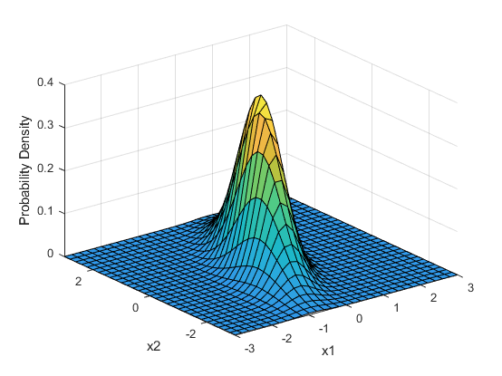

# Distribuições de probabilidade conjunta

## Vetores aleatórios

Vimos até agora distribuições de probabilidade referentes a uma única variável aleatória.

Entretanto, é comum termos interesse em analisar probabilidades de duas ou mais variáveis aleatórias simultaneamente.

Ex: lançar uma moeda 3 vezes. Seja $X_i$ a v.a. indicando o resultado do $i$-ésimo lançamento ($X_i=1$, se cara e $X_i=0$, se coroa). Então o resultado do experimento é representado pelo **vetor aleatório**:
$$\mathbf{X}=(X_1,X_2,X_3)$$

## Duas variáveis aleatórias discretas

Sejam $X$ e $Y$ duas v.a. discretas definidas no espaço amostral $\Omega$ de um experimento e $\mathbf{X}=(X,Y)$ o vetor aleatório. A **função de probabilidade conjunta** $p(\mathbf{x})$ é definida para cada par de números $\mathbf{x}=(x,y)$ por:

$$p(\mathbf{x})=p(x,y)=P(X=x, Y=y)$$
Temos que $p(\mathbf{x})\geq0$ e $\sum_x\sum_yp(x,y)=1$.

Agora, seja $A$ qualquer conjunto particular que consista em pares de valores $\mathbf{x}$. Então:
$$P[\mathbf{X}\in A]=\sum_{\mathbf{x}\in A}p(\mathbf{x})$$

Ex: $A=\{(x,y): x+y=5\}$ ou $A=\{(x,y): \max(x,y)\leq 3\}$.

## Exemplo

Ao adquirir um seguro residencial ou para carro, a pessoa deve escolher o valor da franquia. Uma empresa oferece os seguintes valores de franquia para carro: $\$100$, $\$250$. Para residência: $\$0$, $\$100$, $\$200$. Considere selecionar ao acaso um cliente com essas duas apólices na empresa. 

$X$: franquia do carro $Y$: franquia da residência. Temos a seguinte tabela de probabilidade conjunta:

$P(X=100,Y=0)=0.2$, $P(X=250,Y=200)=0.30$.

## Exemplo

$X$: franquia do carro $Y$: franquia da residência. Temos a seguinte tabela de probabilidade conjunta:

$P(Y\geq 100) = P(X=100,Y=100)$
$+P(X=250,Y=100)+P(X=100,Y=200)$
$+ P(X=250,Y=200)=0.75$

$P(X=100) = P(X=100,Y=0)+P(X=100,Y=100)$
$+P(X=100,Y=200)=0.50$

## Distribuição Marginal

A **função massa de probabilidade marginal de $X$**, denotada por $p_X(x)$ é dada por:

$$p_X(x)=\sum_{y:p(x,y)>0}p(x,y)$$
A **função massa de probabilidade marginal de $Y$**, denotada por $p_Y(y)$ é dada por:

$$p_Y(y)=\sum_{x:p(x,y)>0}p(x,y)$$

## Duas variáveis contínuas

A probabilidade de que o valor observado de uma v.a. contínua $X$ fique no conjunto unidimensional $A$ (um intervalo, por exemplo) é obtida ao integrar a f.d.p. $f_X(x)$ sobre o conjunto $A$.

A probabilidade de que o par $(X,Y)$ das v.a. contínuas caiam em um conjunto bidimensional $A$ (um retângulo, por exemplo) é obtida ao integrar a chamada **função da densidade conjunta**.

## Função de densidade de probabilidade conjunta

Sejam $X$ e $Y$ v.a. contínuas. Uma f.d.p. conjunta $f_{X,Y}(x,y)$ para essas duas v.a.'s deve satisfazer:

$$f_{X,Y}(x,y)\geq0$$

$$\int_{-\infty}^{\infty}\int_{-\infty}^{\infty}f_{X,Y}(x,y)dxdy=1$$

Em particular, caso $A$ seja o retângulo bidimensional $\{(x,y): a\leq x\leq b,\, c<y\leq d\}$, então

$$P[(X,Y)\in A]=P(a\leq X\leq b,\,c\leq Y\leq d)=\int_a^b\int_c^df_{X,Y}(x,y)dydx$$

## Função de densidade de probabilidade conjunta

$$P[(X,Y)\in A]=P(a\leq X\leq b,\,c\leq Y\leq d)=\int_a^b\int_c^df_{X,Y}(x,y)dydx$$

é o volume sob a superfície de densidade, considerando a região $A$.

## Distribuição Marginal

As **funções densidade de probabilidade marginal** de $X$ e $Y$, denotadas por $f_X(x)$ e $f_Y(y)$, são dadas por:

$$f_X(x)=\int_{-\infty}^{\infty}f_{X,Y}(x,y)dy\,,\quad -\infty<x<\infty$$
$$f_Y(y)=\int_{-\infty}^{\infty}f_{X,Y}(x,y)dx\,,\quad -\infty<y<\infty$$

## Variáveis aleatórias independentes

Duas v.a. $X$ e $Y$ são **independentes** se, para cada par de valores $x$ e $y$:

* se $X$ e $Y$ são discretas:

$$P(X=x,Y=y)=P(X=x)P(Y=y)$$

* se $X$ e $Y$ são contínuas:

$$f_{X,Y}(x,y)=f_X(x)f_Y(y)$$

## Mais de duas v.a.'s {.smaller}

Se $X_1,X_2,\ldots,X_n$ são v.a.'s discretas, a função de massa de probabilidade conjunta é:

$$P(X_1=x_1,X_2=x_2,\ldots,X_n=x_n)$$

Se as v.a.'s são contínuas, a f.d.p. conjunta é $f_{X_1,X_2,\ldots,X_n}(x_1,x_2,\ldots,x_n)$ de forma que para qualquer intervalo $[a_1,b_1],\ldots,[a_n,b_n]$:

$$P(a_1\leq X_1\leq b_1,\ldots,a_n\leq X_n\leq b_n)=\int_{a_1}^{b_1}\ldots\int_{a_n}^{b_n}f_{X_1,X_2,\ldots,X_n}(x_1,x_2,\ldots,x_n)dx_n\ldots dx_1$$

## Independência

As v.a.'s $X_1,X_2,\ldots,X_n$ são ditas **independentes** se para cada subconjunto $X_{i_1},X_{i_2},\ldots,X_{i_k}$ das variáveis (cada par, cada trip, etc...) a f.m.p. ou f.d.p. conjuntas do subconjunto for igual ao produto das f.d.p. ou f.m.p. marginais.

## Distribuições condicionais

Sejam $X$ e $Y$ duas v.a. contínuas com f.d.p. conjunta $f_{X,Y}(x,y)$ e f.d.p. marginal de $X$ $f_X(x)$. Então, para qualquer valor $X$ de $x$ para o qual $f_X(x)>0$, a **função densidade de probabilidade condicional de $Y$ dado que $X=x$** é:

$$f_{Y\mid X}(y\mid x)=\frac{f_{X,Y}(x,y)}{f_X(x)}\quad -\infty < y < \infty$$

Se $X$ e $Y$ forem discretas, substituir as f.d.p. por f.m.p. nesta definição fornecerá a **função massa de probabilidade condicional de $Y$ quando $X=x$**.

## Exemplo - Vetor Aleatório {.build}

Cada cliente em uma loja deve escolher apenas entre 3 formas de pagamento disponíveis: dinheiro, crédito ou débito. Consideremos o experimento aleatório observar a escolha do cliente na forma de pagamento. Assumiremos que os experimentos são independentes. 

Sejam $p_1$, $p_2$ e $p_3$ as probabilidades do cliente escolher dinheiro, crédito e débito, respectivamente.

Dentre 10 clientes que chegaram na loja e efetuaram uma compra, qual a probabilidade de que os 5 primeiros paguem com dinheiro, os 3 seguintes com crédito e os 2 últimos com débito?

Resultado experimental igual a: $1111122233$, com probabilidade:

> $p_1^5\times p_2^3\times p_3^2$

## Exemplo {.build}

Resultado experimental igual a: $2223311111$, com probabilidade:

> $p_1^5\times p_2^3\times p_3^2$

Resultado experimental igual a: $1122311123$, com probabilidade:

> $p_1^5\times p_2^3\times p_3^2$

Temos muitas combinações possíveis, que resultam em 5 pagando em dinheiro, 3 com crédito e 2 com débito.

## Exemplo {.build}

Seja $X_i$ o total de clientes que escolhem a forma de pagamento $i$. 

Se quisermos saber a probabilidade de que exatamente 5 clientes paguem com dinheiro, 3 paguem com crédito e 2 com débito, precisamos somar todas as probabilidades das combinações que resultem nesse total de clientes em cada categoria, que são $\binom{10}{5}\binom{5}{3}\binom{2}{2} =2520$ combinações.

$$P(X_1=5,X_2=3,X_3=2) = \frac{10!}{5!3!2!}p_1^5p_2^3p_3^2$$

## Distribuição Multinomial

É uma generalização do experimento de Bernoulli, podendo ter resultados possíveis em uma dentre $r$ categorias.

Cada resultado possível

**Modelo Multinomial**

a) O resultado de cada experimento pode ser classificado em uma de $r$ respostas.

b) A probabilidade da experimento assumir o valor $i$ é $p_{i}$, $i=1, 2, \ldots,r$, com $$\sum_{i=1}^{r}p_{i}=1$$ 

c) As observações são independentes.

## Distribuição Multinomial 

Considere repetições de $n$ experimentos independentes e idênticos. Cada experimento pode resultar em uma dentre $r$ categorias de resultados possíveis.

Denotaremos por $X_i$ o total de experimentos que resultaram na categoria $i$. Denotamos por $p_i$ a probabilidade de um experimento resultar na categoria $i$.

$\mathbf{X}=(X_1,X_2,\ldots,X_r)\sim Multinomial (n,p_1,p_2,\ldots,p_r)$ tem distribuição de probabilidade dada por:

$$P(X_1=n_1, X_2=n_2, \ldots , X_r=n_r)=\frac{n!}{n_1! \ldots n_r!}p_1^{n_1}p_2^{n_2} \ldots p_r^{n_r}$$

em que $\displaystyle \sum_{i=1}^{r}n_{i}=n$ e com $\displaystyle \sum_{i=1}^{r}p_{i}=1$.

Note que $r=2$, a distribuição Multinomial se reduz à Binomial.

## Distribuição Multinomial

Ex: urna com 3 bolas vermelhas, 4 bolas brancas e 5 bolas azuis.

Retiramos 3 bolas da urna, anotamos a cor sorteada, mas a bola é devolvida à urna depois de cada retirada (sorteio com reposição).

Seja $\mathbf{X}=(X_1,X_2,X_3)$ o vetor aleatório representando o número de bolas vermelhas, brancas e azuis sorteadas, respectivamente.

Então $\mathbf{X}\sim Multinomial(3,3/12,4/12,5/12)$.

Qual a probabilidade de obter 3 bolas azuis?

$$P(X_1=0,X_2=0,X_3=0)=(5/12)^3$$

## Distribuição Multinomial

Se designarmos a componente $n_1$ como "sucesso" e juntarmos as demais numa mesma que designamos "fracasso", a variável aleatória $n_1$ é o número de sucessos em $n$ ensaios de Bernoulli, ou seja,  $n_1 \sim Bin(n,p_1)$.  

Portanto: $\qquad \mathbb E(n_1)=np_1 \qquad$ e  $\qquad Var(n_1)=np_1(1-p_1)$. 

Analogamente aplicando o mesmo argumento a cada $n_i$ temos: 
$$\mathbb E(n_i)=np_i \qquad \mbox{e} \qquad Var(n_i)=np_i(1-p_i)$$

## Esperança Condicional {.smaller}

Vimos que os valores observados de uma v.a. $X$ podem mudar consideravelmente a distribuição de uma outra v.a. $Y$, isto é, a distribuição de $Y\mid X=x$ pode ser diferente da distribuição de $Y$. Obs: casos em que $X$ e $Y$ são independentes, esta mudança não ocorre.

Além de conhecer a distribuição de $Y\mid X=x$, devemos conhecer também sua esperança.

* Caso discreto: Sejam $X$ e $Y$ v.a.'s discretas e seja $x$ um número ral tal que $p_X(x)>0$.

$$\psi(x)=E(Y\mid X=x) = \sum_y yp_{Y\mid X}(y\mid x)$$
Note que $\psi(.)$ é uma função da v.a. $X$, portanto temos a v.a.:

$$\psi(X)=E(Y\mid X)$$

## Esperança Condicional

Exemplo: Suponha uma sequência de $n$ ensaios de Bernoulli independentes com probabilidades de sucesso $p$

*   Sejam X e Y os números de sucessos e fracassos, respectivamente
*  A distribuição de massa conjunta é:

$$p_{X,Y}(k,n-k)=\binom{n}{k}p^k(1-p)^{n-k}\,, k=0,1,\ldots,n$$

Para cada $k=0,1,2,\ldots,n$:

$$p_{Y\mid X}(l\mid k)=\begin{cases}
1\quad\mbox{se } l=n-k\\
0\quad\mbox{caso contrário}
\end{cases}$$

$$ \psi(k)=E(Y\mid X=k)=n-k$$

Portanto:

$$E(Y\mid X)=n-X$$

## Esperança Condicional

* Caso contínuo: Sejam $X$ e $Y$ v.a.'s contínuas e seja $x$ um número real tal que $f_X(x)>0$. A esperança condicional de $Y$ dados $X=x$ 
e dada por:

$$\psi(x)=E(Y\mid X=x)=\int_{-\infty}^{\infty}yf_{Y\mid X}(y\mid x)dy$$
Assim, como no caso discreto, $\psi(.)$ é uma função da v.a. X, portanto é também uma v.a.:

$$\psi(X) = E(Y \mid X)$$

## Exemplo - Normal Bivariada

Seja $(X,Y)$ um vetor aleatório que segue a distribuição normal bivariada:

$$f_{X,Y}(x,y)=\frac{1}{2\pi \sqrt{1-\rho^2}}\exp\left[-\frac{x^2-2\rho xy+y^2}{2(1-\rho^2)}\right]$$
em que $\rho\in (-1,1)$.

## Exemplo - Normal Bivariada

As marginais de $X$ e $Y$ são normais (confira!).

$$f_{Y\mid X}(y\mid x)=\frac{f_{X,Y}(x,y)}{f_X(x)}\quad -\infty < y < \infty$$

$$f_{Y\mid X}(y\mid x) = \frac{1}{\sqrt{2\pi(1-\rho^2)}}\exp\left[ -\frac{(y-\rho x)^2}{1(1-\rho^2)}\right]$$
$$Y\mid X=x\sim N(\rho x, (1-\rho^2))$$

$$\psi(x)=E(Y\mid X=x)=\rho x$$

$$\psi(X)=E(Y\mid X)=\rho X$$

Veja que à medida que a correlação $\rho$ aumenta, as variáveis $X$ e $E(Y\mid X)$ se aproximam.

## Propriedades

Sejam $X$ e $Y$ v.a.'s e $g$ uma função real contínua. Então:

$$E(Y)=E[E(Y\mid X)]$$

$$E[Y g(X)]=E[E(Y\mid X)g(X)]$$

* Se $X$ é uma v.a. discreta:

$$E(Y)=\sum_x E(Y\mid X=x)P(X=x)$$

* Se $X$ é uma v.a. contínua:

$$E(Y)=\int_{-\infty}^{\infty}E(Y\mid X=x)f_X(x)dx$$

## Leituras

* Devore: capítulo 5.
* Magalhães: capítulo 5.

  

Slides produzidos pelos professores:

* Samara Kiihl

* Tatiana Benaglia

* Benilton Carvalho